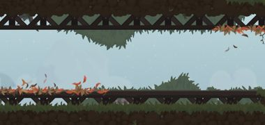

Playable Characters
===





    

        <input type="checkbox" id="toggle-char-{{ character.name | slugify }}" class="unfolder">
        <label for="toggle-char-{{ character.name | slugify }}" class="toggle-label">
            <h2 id="character-{{ character.name | slugify }}">{{ character.name }}</h2>
            

	            
                <ul id="charstats-{{ character.name | slugify }}" class="char-stats stats">
                    
                        
                        
	                        <li class="character-stat character-stat-{{ stat[0] }} stat">
	                            {{ stat[0] }}
	                            {{ character[character_stat_key] }}
	                        </li>
                        
                    
                </ul>
                

                    

                        {{ character.content | markdownify }}
                    

                

            

        </label>
    



Levels
===

FIXME: Level stats only have the raw stat - mouseover for highlight!


    

        <h2 id="maps-{{ mapgroup | slugify }}">{{ mapgroup | capitalize }}</h2>
        

             
            
                
                

                    <h3 id="maps-level-{{ map.name | slugify }}">{{ map.name }}</h3>
                    

                        
                        
                        
                            
                        
                        
                            
                                
                            
                            
                                
                            
                            
                            
                            

                                 <strong>{{ stat[0] }}</strong> {{ stat[1] }}
                            

                        
                    

                    

                        {{ map.content }}
                    

                

                
                

                    
                    

                        <h3 id="maps-level-{{ map.name | slugify }}" style="background-image: url(assets/img/maps/downhill.jpg)">
                            {{ map.name }}
                        </h3>
                        

                            
General

                            <ul>
                                
                                    
                                    
                                
                            </ul>
                        

                    

                    

                        
Tiles

                        <ul>
                            
                                
                                    
                                     Layer {{ key }} 
                                    
                                    
                                
                            
                        </ul>
                    

                    

                        
Dust

                        <ul>
                            
                                
                                
                            
                        </ul>
                    

                    

                        
Enemies

                        <ul>
                            
                                
                                    
                                    
                                    
                                
                            
                        </ul>
                    

                

            
        

    



Enemies
===





    

        <h2 id="{{ enemygroup }}-enemies">{{ enemygroup | capitalize }}</h2>
        

            
            
                

                    <h3 id="enemy-{{ enemy.name | slugify }}">{{ enemy.name }}</h3>
                    

                        
                            
                            
                                
                                    
                                
                                    
                                
                                

                                    
                                    
                                        
                                    
                                        
                                    
                                    
                                    {{ output_string }}
                                

                            
                        
                    

                    

                        {{ enemy.content }}
                    

                

            
        

    



Mechanics / Tech
===


    
    
    
        
    
    <h2 id="{{ techgroup }}-tech">{{ techgroup | capitalize }}</h2>
    
        

            

                <h3 id="{{ tech.name | slugify }}">{{ tech.name }}</h3>
                
                
                    
                        
                            tags:
                        
                        
                            {{ tech.tags | join: ", " }}
                        
                    
                
            

            
{{ tech.content }}

        

    


